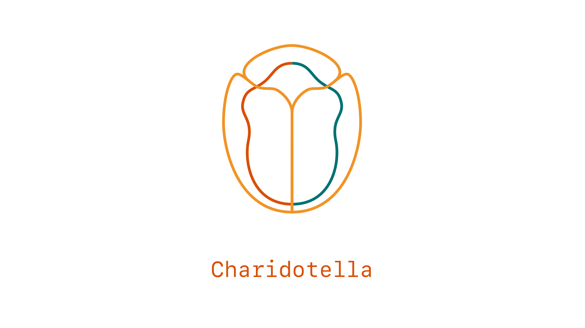

Charidotella (https://en.wikipedia.org/wiki/Charidotella_sexpunctata) is a toolbox to organise and visualise Event Stream (.es) recordings.

It supports Python 3.9, 3.10, and 3.11.

- [Dependencies](#dependencies)
- [Get started](#get-started)
- [Contribute](#contribute)

## Dependencies

-   **Debian / Ubuntu**

    ```sh
    sudo apt install ffmpeg python3 python3-pip vlc
    ```

-   **macOS**

    1. Install Homebrew (https://brew.sh)
    2. Run in a terminal
        ```sh
        brew install ffmpeg python3
        ```

-   **Windows**

    1. Run in an elevated Powershell (right-click > Run as Administrator)
        ```powershell
        winget install python3 --scope machine
        winget install ffmpeg --scope machine
        ```
    2. Reboot the machine

## Get started

1. Install the Python package

    -   **Debian / Ubuntu**
        ```sh
        sudo python3 -m pip install charidotella
        ```

    -   **macOS**
        ```sh
        python3 -m pip install charidotella
        ```

    -   **Windows**

        Run in an elevated Powershell (right-click > Run as Administrator)
        ```powershell
        & 'C:\Program Files\Python311\python.exe' -m pip install charidotella
        ```


2. Create a directory _my-wonderful-project_ with the following structure (the file names do not matter as long as their extension is _.es_)

    ```txt
    my-wonderful-project
    └── recordings
        ├── file_1.es
        ├── file_2.es
        ├── ...
        └── file_n.es
    ```

3. Generate a configuration file

    ```sh
    cd my-wonderful-project
    charidotella init 'recordings/*.es'
    ```

    The directory now has the following structure

    ```txt
    my-wonderful-project
    ├── recordings
    │   ├── file_1.es
    │   ├── file_2.es
    │   ├── ...
    │   └── file_n.es
    └── charidotella-configuration.toml
    ```

4. (Optional) Edit `charidotella-configuration.toml` to change the jobs' parameters

5. Run the jobs

    ```
    charidotella run
    ```

    The directory now has the following structure

    ```txt
    my-wonderful-project
    ├── recordings
    │   ├── file_1.es
    │   ├── file_2.es
    │   ├── ...
    │   └── file_n.es
    ├── renders
    │   ├── adjective-animal-1
    │   │    ├── filtered-recording.es
    │   │    ├── rendered-file-1.es
    │   │    ├── ...
    │   │    └── rendered-file-m.es
    │   ├── adjective-animal-2
    │   ├── ...
    │   └── adjective-animal-n
    └── charidotella-configuration.toml
    ```

6. (Optional) Edit `charidotella-configuration.toml` and run `charidotella run` again (job that have already been completed will be skipped unless `--force` is used)

See `charidotella --help` for a list of other options.

## Contribute

After code edits, run the formatters and linters.

```
isort .; black .; pyright .
```
